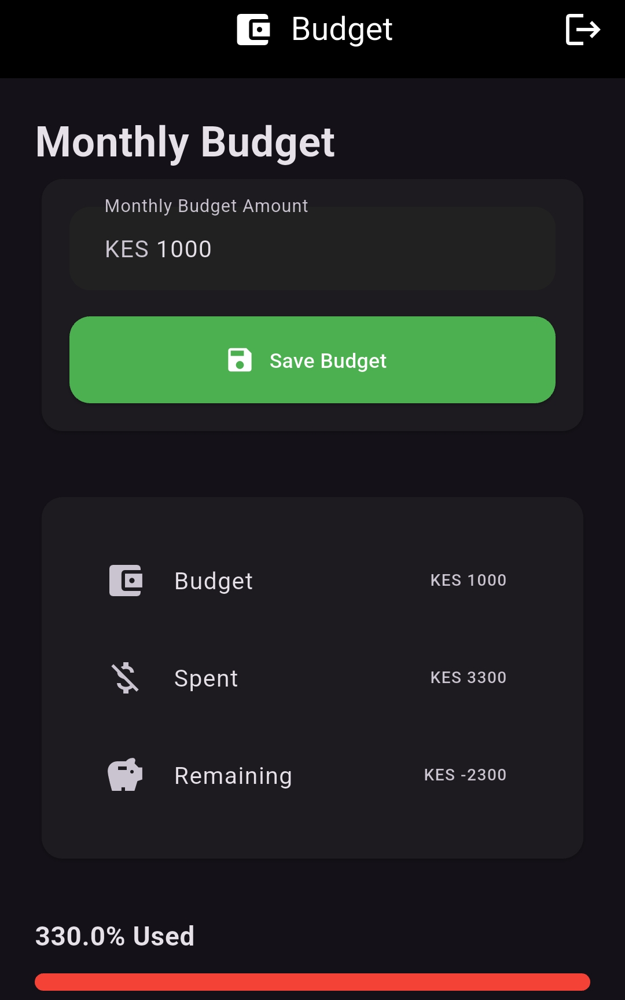
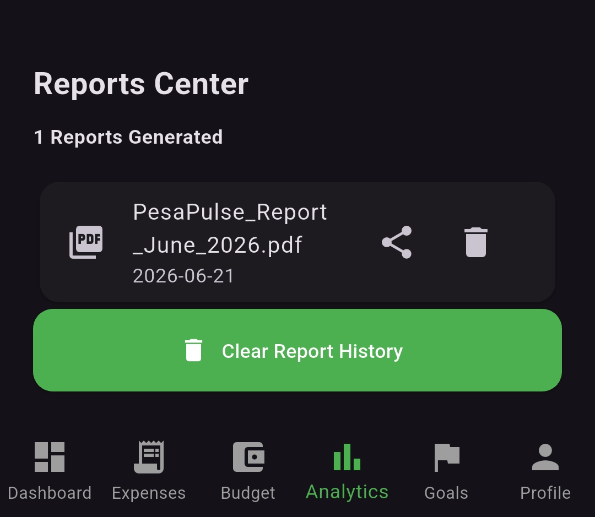
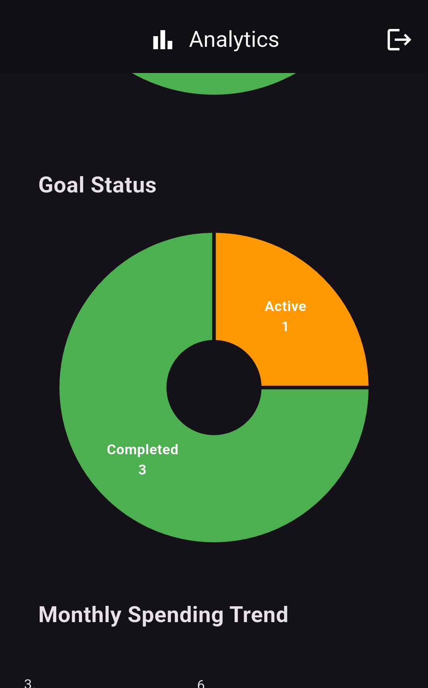
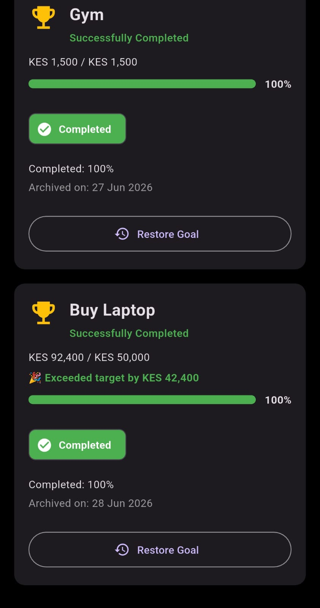
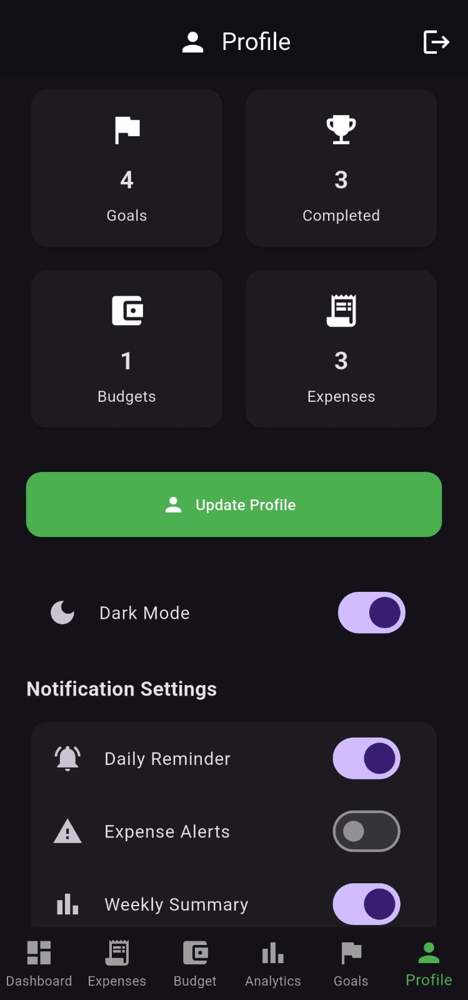

# 💰 PesaPulse

> **Smart Personal Finance Management System**

PesaPulse is a modern personal finance application built with **Flutter** and **Laravel** that helps users manage expenses, budgets, savings goals, and financial insights through intelligent analytics and forecasting.


---

<h2 align="center">📱 Application Preview</h2>

<p align="center">
  
  
</p>

<p align="center">
  
  
</p>

<p align="center">
  
  
</p>

<p align="center">
  
  
</p>

---

# ✨ Features

## 💰 Expense Management

* Add expenses
* Edit expenses
* Delete expenses
* Expense categorization
* Monthly expense tracking

---

## 💵 Income Management

* Add income
* Track income sources
* Monthly income summary

---

## 📊 Budget Management

* Create monthly budgets
* Budget health indicators
* Spending progress bars
* Budget recommendations
* Overspending alerts

---

## 🎯 Financial Goals

* Create savings goals
* Track progress
* Milestone achievements
* Goal forecasting
* Goal analytics
* Archive completed goals
* Restore archived goals
* Smart recommendations

---

## 📈 Analytics

* Financial Health Score
* Spending Trends
* Category Breakdown
* Goal Status
* Smart Insights
* Export Reports (PDF & CSV)

---

## 🔔 Notifications

* Daily reminders
* Goal milestone notifications
* Weekly financial summaries
* Budget alerts

---

## 👤 User Profile

* Edit profile
* User statistics
* Notification preferences
* Dark mode

---

# 🧠 Smart Features

* Goal Forecasting
* Goal Completion Prediction
* Smart Budget Recommendations
* Financial Health Analysis
* Intelligent Savings Suggestions

---

# 🏗 System Architecture

```text
Flutter Mobile App
        │
 REST API (Laravel)
        │
    MySQL Database
```

---

# 🛠 Technology Stack

## Frontend

* Flutter
* Dart

## Backend

* Laravel
* PHP

## Database

* MySQL

## Authentication

* Laravel Sanctum

## Notifications

* Flutter Local Notifications

---

# 📂 Project Structure

```text
lib/
├── screens/
├── widgets/
├── services/
├── models/
├── utils/

backend/
├── app/
├── routes/
├── database/
├── migrations/
```

---

# 🚀 Installation

## Backend

```bash
git clone <repository>

cd backend

composer install

cp .env.example .env

php artisan key:generate

php artisan migrate

php artisan serve
```

---

## Flutter

```bash
flutter pub get

flutter run
```

---

# 📸 Screenshots

<p align="center">
  <a href="docs/screenshots/dashboard.jpeg">
    
  </a>

  <a href="docs/screenshots/budget-overview.jpeg">
    
  </a>
</p>

<p align="center">
  <a href="docs/screenshots/analytics-dashboard.jpeg">
    
  </a>

  <a href="docs/screenshots/profile-overview.jpeg">
    
  </a>
</p>

<p align="center">
  <sub><b>Dashboard</b></sub>
  &nbsp;&nbsp;&nbsp;&nbsp;&nbsp;&nbsp;&nbsp;&nbsp;&nbsp;&nbsp;&nbsp;&nbsp;&nbsp;&nbsp;&nbsp;&nbsp;&nbsp;&nbsp;&nbsp;&nbsp;&nbsp;&nbsp;&nbsp;&nbsp;&nbsp;&nbsp;&nbsp;&nbsp;&nbsp;&nbsp;
  <sub><b>Budget Overview</b></sub>
</p>

<p align="center">
  <sub><b>Analytics Dashboard</b></sub>
  &nbsp;&nbsp;&nbsp;&nbsp;&nbsp;&nbsp;&nbsp;&nbsp;&nbsp;&nbsp;&nbsp;&nbsp;&nbsp;&nbsp;&nbsp;&nbsp;
  <sub><b>Profile Overview</b></sub>
</p>

---

# 📊 Version History

| Version | Description                     |
| ------- | ------------------------------- |
| v2.0.0  | Smart Financial Planning Update |
| v1.0.0  | Initial Public Release          |

---

# 🗺 Roadmap

## ✅ Version 1.0

* Authentication
* Expenses
* Income
* Budgets
* Basic Analytics

---

## ✅ Version 2.0

* Smart Goal Forecasting
* Archived Goals
* Advanced Analytics
* Notification Service
* Smart Budget Insights
* Goal Analytics
* Goal Forecast API

---

## 🚧 Planned (v2.1)

* Recurring Transactions
* Subscription Tracking
* AI Spending Predictions
* Financial Health Improvements
* Enhanced Dashboard

---

# 🤝 Contributing

Contributions, issues, and feature requests are welcome.

If you'd like to improve PesaPulse, feel free to fork the repository and submit a pull request.

---

# 📄 License

This project is licensed under the MIT License.

---

# 👨‍💻 Developer

**Ramson Lonayo**

Third-Year Software Engineering Student

Kirinyaga University

---

## ⭐ Support

If you found this project useful, consider giving it a **⭐ Star** on GitHub.
