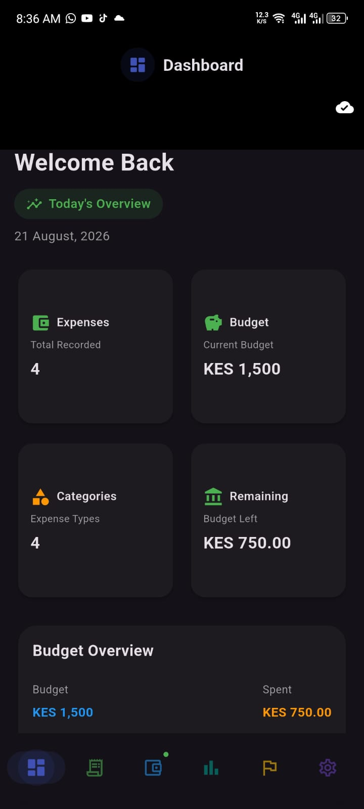
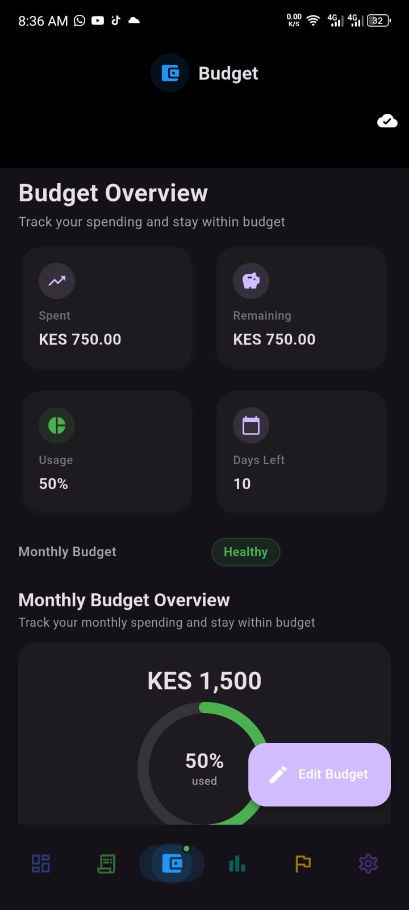
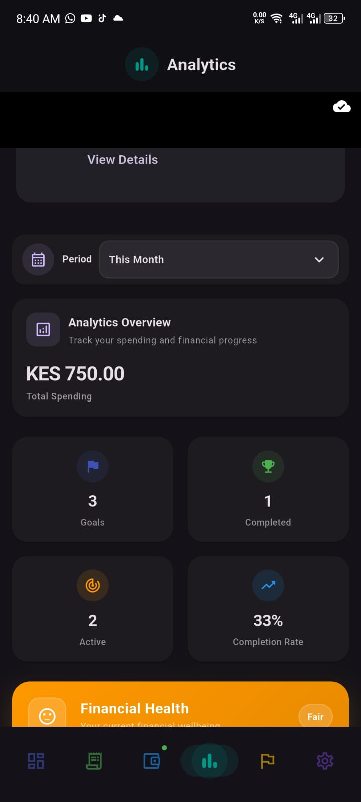
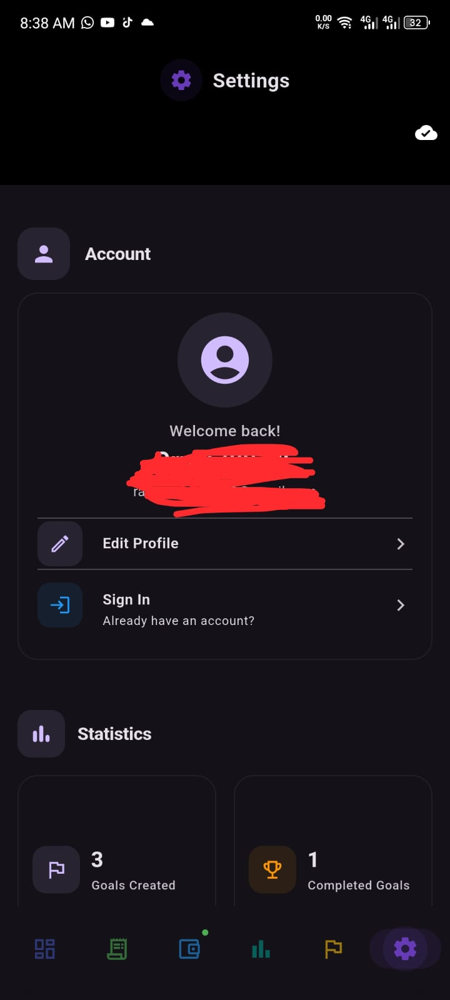

# 💰 PesaPulse

> **Smart Personal Finance Management System**

PesaPulse is a modern personal finance application built with **Flutter** and **Laravel** that helps users manage expenses, income, budgets, savings goals, and financial insights through intelligent analytics and forecasting.

Designed with an **offline-first architecture**, PesaPulse ensures you can continue managing your financial data even without internet connectivity. Data is synchronized automatically when connectivity is restored.

---

## 🚀 What's New in v1.0.0

- Modern login and registration experience  
- Secure authentication using Laravel Sanctum  
- Guest mode with guest-to-user migration  
- Redesigned authentication screens  
- New onboarding experience with interactive pages  
- Persistent onboarding completion state  
- Smart analytics redesign with improved insights  
- Offline-first synchronization with pending changes tracking  
- Material 3 design system with responsive layouts  
- Optimized performance and navigation cleanup  

---

## ✨ Features

### 💰 Expense Management
- Add, edit, delete expenses
- Categorization, filtering, searching, sorting
- Monthly expense tracking
- Offline expense management
- Automatic & manual synchronization
- Sync status tracking

### 💵 Income Management
- Add and track income sources
- Monthly income summary
- Offline income management
- Income synchronization

### 📊 Budget Management
- Create, edit, delete monthly budgets
- Budget health indicators & overspending alerts
- Spending progress bars
- Daily spending trends
- Budget insights & recommendations
- Offline budget management
- Automatic synchronization

### 🎯 Financial Goals
- Create, edit, delete savings goals
- Track progress & milestones
- Forecasting & analytics
- Archive/restore completed goals
- Goal completion predictions
- Offline goal management
- Goal notifications

### 📈 Analytics
- Financial Health Score
- Smart Recommendations
- Spending trends & category breakdown
- Goal progress analytics
- PDF & CSV export
- Cached analytics for offline access

### 🔔 Notifications
- Daily reminders & weekly summaries
- Goal milestone alerts
- Budget alerts & deadline reminders
- Local notification support

### 🔐 Security
- Secure authentication with Laravel Sanctum
- OTP verification & password reset
- Session management & account deletion
- User-specific & guest-specific data ownership
- Protected local financial data

---

## 🧭 Onboarding Experience
- First-launch onboarding with interactive pages  
- Clear introduction to PesaPulse features  
- "Get Started" flow and "Jump In" shortcut  
- Dedicated authentication choice screen  
- Guest mode with migration to authenticated accounts  

---

## 🏗 System Architecture

```text
┌───────────────────────────┐
│      Flutter Mobile App   │
│  UI / Screens / Widgets   │
│  Repositories             │
│  Local SQLite Database    │
│  Offline Sync             │
└─────────────┬─────────────┘
              │ REST API
              ▼
┌───────────────────────────┐
│       Laravel Backend     │
│  Authentication           │
│  Business Logic           │
│  REST API                 │
│  Laravel Sanctum          │
└─────────────┬─────────────┘
              │
              ▼
┌───────────────────────────┐
│       MySQL Database      │
└───────────────────────────┘
```

---

## 🌐 Backend API

RESTful API built using Laravel.

## Main Modules

- Authentication
- Expenses
- Budgets
- Goals
- Analytics
- Notifications
- User Preferences
- Settings

---

# 🛠 Technology Stack

## Frontend

- Flutter
- Dart

## Backend

- Laravel
- PHP

## Database

- MySQL
- SQLite (local/offline)

## Authentication

- Laravel Sanctum

## Notifications

- Flutter Local Notifications

## Architecture

- Repository Pattern
- Offline-First
- REST API
- Local Caching
- Background Sync

---

# 📂 Project Structure

```text
lib/
├── screens/
├── widgets/
├── services/
├── models/
├── repositories/
├── providers/
├── controllers/
├── utils/
└── database/

backend/
├── app/
├── routes/
├── database/
├── migrations/
└── config/

```

---

# 🚀 Installation

## Backend

```bash
git clone <repository>

cd backend

composer install

cp .env.example .env

php artisan key:generate

php artisan migrate

php artisan serve
```

---

## Flutter

```bash
flutter pub get

flutter run
```
---

# 📦 Releases

### Latest Stable Release

**PesaPulse v1.0.0**

The first stable production release of PesaPulse.

### Historical Beta Releases

- **v0.1.0-beta** — Initial feature set
- **v0.2.0-beta** — Smart goals and advanced analytics
- **v0.3.0-beta** — Settings, notifications and branding
- **v0.4.0-beta** — Smart Analytics, Financial Health Score and Reports Center

---

# 🎥 Demo

A demonstration of PesaPulse is planned for a future release.

Demo video coming soon...

---

# 📸 Screenshots

<p align="center">
  <a href="docs/screenshots/dashboard.jpeg">
    
  </a>

  <a href="docs/screenshots/budget_overview.jpeg">
    
  </a>
</p>

<p align="center">
  <a href="docs/screenshots/analytics-dashboard.jpeg">
    
  </a>

  <a href="docs/screenshots/settings-profile.jpeg">
    
  </a>
</p>

<p align="center">
  <sub><b>Dashboard</b></sub>
  &nbsp;&nbsp;&nbsp;&nbsp;&nbsp;&nbsp;&nbsp;&nbsp;&nbsp;&nbsp;&nbsp;&nbsp;&nbsp;&nbsp;&nbsp;&nbsp;&nbsp;&nbsp;&nbsp;&nbsp;&nbsp;&nbsp;&nbsp;&nbsp;&nbsp;&nbsp;&nbsp;&nbsp;&nbsp;&nbsp;
  <sub><b>Budget Overview</b></sub>
</p>

<p align="center">
  <sub><b>Analytics Dashboard</b></sub>
  &nbsp;&nbsp;&nbsp;&nbsp;&nbsp;&nbsp;&nbsp;&nbsp;&nbsp;&nbsp;&nbsp;&nbsp;&nbsp;&nbsp;&nbsp;&nbsp;
  <sub><b>Profile Overview</b></sub>
</p>

---

# 🌟 Highlights

- 📱 Material 3 Design
- 📊 Smart Financial Analytics
- 💰 Intelligent Budget Management
- 🎯 Savings Goal Tracking
- 📈 Financial Health Score
- 📄 PDF & CSV Report Export
- 🌙 Dark Mode Support
- 🔔 Smart Notifications
- 👤 Guest Mode
- 🔄 Guest-to-User Data Migration
- 📡 Offline-First Architecture
- 🔄 Automatic Synchronization
- ⚡ Optimized Performance
- 📱 Responsive Mobile Experience
- 🔐 Secure Authentication
- 📊 Personalized Financial Insights

---

# 📊 Version History

| Version | Release | Highlights |
|---------|---------|------------|
| **v1.0.0** | Stable | Production release with onboarding, authentication, guest mode, guest-to-user migration, offline-first synchronization, analytics, budgets, goals, notifications and UI/UX improvements |
| **v0.4.0-beta** | Beta | Smart Analytics redesign, Financial Health Score, Reports Center, UI polish |
| **v0.3.0-beta** | Beta | Settings redesign, password management, notifications, branding and UX improvements |
| **v0.2.0-beta** | Beta | Smart goals, advanced analytics, budget intelligence and financial insights |
| **v0.1.0-beta** | Beta | Initial PesaPulse feature set including expense tracking, budgets and authentication |
---

# 🗺 Roadmap

## ✅ Version 1.0 Stable

- The first stable production release of PesaPulse.

### 🔐 Authentication
- User registration and login
- Guest mode
- Guest-to-user migration
- OTP verification
- Password reset
- Session management
- Account deletion

---

### 💰 Financial Management
- Expense management
- Budget management
- Savings goals
- Goal forecasting
- Goal analytics
- Financial analytics
---

### 📡 Offline-First
- Local SQLite storage
- Offline financial management
- Background synchronization
- Automatic synchronization
- Manual synchronization
- User-specific local data
- Guest-specific local data
---
### 🎨 User Experience
- Onboarding experience
- Material 3 interface
- Responsive layouts
- Dark mode
- Notifications
- Improved navigation
- Custom application branding


---

## 🚧 Version 1.1.0 — Stability, Security & Reliability

The next release will focus primarily on bug fixes, security hardening,
API rate limiting, synchronization reliability, and overall production stability.

###  🐛 Bug Fixes & Stability

- Fix bugs discovered after the v1.0.0 release
- Improve error handling
- Resolve edge-case synchronization issues
- Improve offline/online transition handling
- Fix UI inconsistencies
- Improve loading and empty states
- Improve application stability
- Address user-reported issues
- General performance improvements

###  🛡️ Security Hardening
- Strengthen API security
- Review authentication and session handling
- Improve authorization checks
- Review user data isolation
- Improve input validation
- Strengthen sensitive endpoint protection
- Review account deletion security
- Improve protection against unauthorized requests
- Perform security audit and hardening

### 🚦 API Rate Limiting
- Implement API rate limiting
- Protect authentication endpoints from excessive requests
- Limit OTP request attempts
- Limit password reset requests
- Protect sensitive API endpoints
- Improve abuse prevention
- Monitor excessive API requests

### ⚡ Performance & Reliability
- Optimize API requests
- Improve synchronization reliability
- Reduce unnecessary network requests
- Improve local database performance
- Optimize application startup
- Improve background synchronization
- Improve error recovery

## 🔮 Future Development

Future releases may introduce additional improvements based on user feedback, testing, and project requirements.

###  Potential areas include:

- Enhanced financial intelligence
- More advanced financial forecasting
- Additional financial reports
- Improved data visualization
- Enhanced notification system
- Additional customization options
- Further security improvements
- Cloud synchronization improvements
- Additional platform support
 

---

# 🤝 Contributing

Contributions, issues, and feature requests are welcome.

If you'd like to improve PesaPulse, feel free to fork the repository and submit a pull request.

When submitting an issue, please provide:

- A clear description of the issue
- Steps to reproduce the problem
- Expected behavior
- Actual behavior
- Screenshots where applicable
- Device and operating system information

---

## ❤️ Built With

- Flutter
- Dart
- Laravel
- PHP
- MySQL
- Material 3
- Laravel Sanctum
- SQLite
- Flutter Local Notifications

---

# 📄 License

This project is licensed under the MIT License.

---

## 👨‍💻 Developer

**Ramson Lonayo**

Software Engineering Student

Kirinyaga University

Passionate about Flutter, Laravel, Mobile Development and Financial Technology.

---

## ⭐ Support

If you found this project useful, consider giving it a **⭐ Star** on GitHub.
